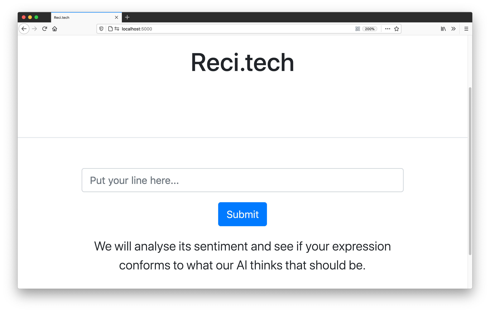

# reci.tech
[Deployment](https://recitech.herokuapp.com/)

Helping actors recite scripts expressively w the help of AI



## Devpost: <https://devpost.com/software/reci-tech-script-recital-aid>

## Demo video: <https://youtu.be/vwbAvUHnfUo>

## Inspiration
The sentiments in our speech often get misinterpreted, especially during the pandemic when everyone covers their faces. We figured if that sentiment analysis AIs trained on daily sentences resemble how people understand emotions, we may adjust how we voice our sentences to what the AI thinks it is to convey our expressions to the most general audience.

That can also help actors, who need expressiveness the most, to communicate to the most lay-people understandably.

## What it does
It takes a line and prompts the user to voice it.
It then analyses the sentiments in both the text and the voice, and compares the two.

## How we built it
Flask back-end and Bootstrap front-end.
The AI is a pre-trained TensorFlow model.

## Challenges we ran into
It is hard to coordinate a team of mostly newbie hackers scattered around 4 time-zones, and we have to mostly work on our own in different hours of the day.

## Accomplishments that we're proud of
4 of the 5 of us are new to hackathons, but we made it work!

## What we learned
Tasks always take pi times more time than expected. We planned to learn and use React on the fly, but realised it is too complex and built a minimum-viable product (MVP) in Bootstrap instead.

## What's next for Reci.tech: Script Recital Aid
AIs surely lack artistic nuances, so we may feed it lines spoken by the best actors and show whether the user conveys similar emotional complexity like the best do.

## Running the app

### Check Python version is ~3.8
``` shell
python --version
cat runtime.txt
```
### Create a virtual environment
``` shell
python -m venv venv
. venv/bin/activate
```
### Install dependencies
``` shell
pip install -r requirements.txt
```
### Run flask
``` shell
export FLASK_APP=app/app.py
python -m flask run
```
